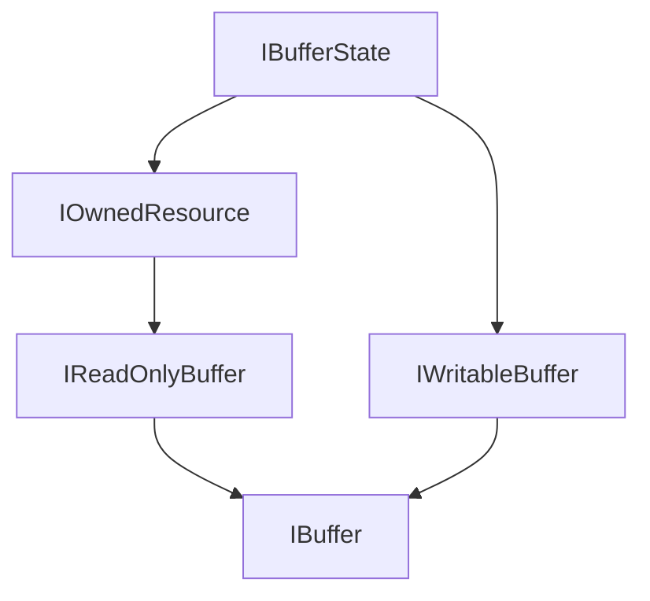

# BitzBuffer 設計仕様 - コアインターフェース

このドキュメントは、バッファ管理ライブラリ「BitzBuffer」の中心となる共通インターフェース群について詳述します。

## 1. はじめに

BitzBufferライブラリは、効率的なメモリ管理と高性能なデータ操作を提供することを目的としています。その中核となるのが、これから定義するインターフェース群です。これらのインターフェースは、マネージドメモリ、アンマネージドメモリ、そして将来的にはGPUメモリといった多様なメモリリソースを統一的に扱うための抽象化レイヤーを提供します。

## 2. 設計思想と主要なゴール

*   **統一性:** 様々な種類のメモリバッファを、共通のインターフェースを通じて操作できるようにします。
*   **パフォーマンス:** `Span<T>` や `Memory<T>`、`ReadOnlySequence<T>` を活用し、メモリアロケーションのオーバーヘッドを最小限に抑え、ゼロコピー操作を促進します。
*   **安全性:** 明確な所有権管理とライフサイクルを通じて、メモリリークやダングリングポインタといった問題を回避します。
*   **柔軟性:** 非連続メモリのサポートや、読み取り専用ビュー、書き込み操作の効率化など、多様なユースケースに対応できる柔軟性を提供します。
*   **拡張性:** 将来的に新しい種類のメモリリソース（例: GPUバッファ）や、より高度なバッファ操作をサポートするための拡張が容易な設計を目指します。

## 3. バッファ共通インターフェース

アプリケーション内で多様なメモリリソースを統一的に扱うため、中心となるバッファインターフェース群を定義します。これらのインターフェースは、非連続メモリへの対応、効率的な読み書き、そして明確な所有権管理とライフサイクルを考慮して設計されています。

### 3.1. 設計のキーポイント

*   **非連続メモリのサポート (`ReadOnlySequence<T>`):**
    *   物理的に連続していない複数のメモリセグメントを、単一の論理的な読み取りシーケンスとして効率的に扱えるようにします。
*   **効率的な書き込み (`GetMemory`/`Advance` パターン):**
    *   `IWritableBuffer<T>.GetMemory(int sizeHint)`: バッファの現在の論理的な末尾以降の、書き込み可能な空きメモリ領域を要求します。
    *   `IWritableBuffer<T>.Advance(int count)`: `GetMemory` で取得した領域に `count` 分のデータを書き込んだことをバッファに通知し、バッファの論理的な書き込み済み長さを進めます。
*   **所有権管理とライフサイクル (`IBufferState`, `IOwnedResource`):**
    *   `IBufferState` は `IsOwner` と `IsDisposed` プロパティを提供。
    *   `IOwnedResource` は `IDisposable` を実装しリソース解放責任を明確化。
    *   所有権の移譲: `TryAttachZeroCopy` や `AttachSequence` で、セグメントの `SegmentSpecificOwner` の解放責任が移譲先に移行。元の所有者は `IsOwnershipTransferred` フラグで解放をスキップ。
*   **バッファの状態操作:** `Clear()` (論理長リセット), `Truncate()` (論理長切り詰め), 生成時オプションでの初期長設定。
*   **読み取り専用ビュー (`Slice`):** `IReadOnlyBuffer<T>.Slice()` は `IsOwner == false` の読み取り専用ビューを返す。
*   **スレッドセーフティ:** 個々の `IBuffer<T>` インスタンスメソッドはスレッドセーフではない。プーリング機構はスレッドセーフ。（詳細は [`./03_プーリング.md`](./03_プーリング.md)）
*   **ゼロコピーアタッチのためのセグメント情報 (`BitzBufferSequenceSegment<T>`):**
    *   `ReadOnlySequenceSegment<T>` を拡張したカスタムセグメントで、所有者情報などを保持。
    *   `IReadOnlyBuffer<T>.AsAttachableSegments()` がこれを提供。

### 3.2. インターフェース階層


*   `IBufferState`: 基本状態（所有権、破棄）。
*   `IOwnedResource`: リソース所有と解放責任 (`IDisposable`)。
*   `IReadOnlyBuffer<T>`: 読み取り専用操作。
*   `IWritableBuffer<T>`: 書き込み専用操作。
*   `IBuffer<T>`: 読み書き可能、完全なバッファ。

### 3.3. インターフェース定義 (C#)

```csharp
using System;
using System.Buffers;
using System.Collections.Generic;
// using BitzBuffer.Core.Internals; // BitzBufferSequenceSegment<T> の名前空間 (仮)

// バッファの所有権と破棄状態を示す基本的な状態インターフェース。
public interface IBufferState
{
    // このインスタンスが基になるリソースの有効な所有権を持つか。
    bool IsOwner { get; }

    // このインスタンスが破棄されているか。
    bool IsDisposed { get; }
}

// リソースの所有と解放の責任を持つインターフェース。
public interface IOwnedResource : IBufferState, IDisposable
{
    // Dispose() はリソースを解放し、状態を更新。
}

// 読み取り専用のバッファ操作を提供するインターフェース。
public interface IReadOnlyBuffer<T> : IOwnedResource
    where T : struct
{
    // 書き込まれた有効なデータの論理長（要素数）。
    long Length { get; }

    // バッファが空 (Length == 0) か。
    bool IsEmpty { get; }

    // バッファが単一の連続セグメントか。
    bool IsSingleSegment { get; }

    // 現在の書き込み済み内容を ReadOnlySequence<T> として取得。
    ReadOnlySequence<T> AsReadOnlySequence();

    // 所有者情報を含む BitzBufferSequenceSegment<T> のシーケンスを取得 (ゼロコピーアタッチ用)。
    IEnumerable<BitzBufferSequenceSegment<T>> AsAttachableSegments(); // BitzBufferSequenceSegment<T> はBitzBufferコア内部型想定

    // 単一セグメントの場合、その ReadOnlySpan<T> を取得試行。
    bool TryGetSingleSpan(out ReadOnlySpan<T> span);

    // 単一セグメントの場合、その ReadOnlyMemory<T> を取得試行。
    bool TryGetSingleMemory(out ReadOnlyMemory<T> memory);

    // 指定範囲の読み取り専用スライスを作成。
    IReadOnlyBuffer<T> Slice(long start, long length);

    // 指定開始位置から末尾までの読み取り専用スライスを作成。
    IReadOnlyBuffer<T> Slice(long start);
}

// AttachSequence メソッドの操作結果を示す enum
public enum AttachmentResult
{
    AttachedAsZeroCopy, // ゼロコピーでアタッチ成功
    AttachedAsCopy,     // コピーしてアタッチ成功
    Failed              // TryAttachZeroCopy でのみ使用: アタッチ失敗
}

// 書き込み専用のバッファ操作を提供するインターフェース。
public interface IWritableBuffer<T> : IBufferState
    where T : struct
{
    // 書き込み用のメモリ領域を要求。
    Memory<T> GetMemory(int sizeHint = 0);

    // 書き込んだ要素数を通知し、論理長を進める。
    void Advance(int count);

    // --- データ書き込みメソッド ---
    void Write(ReadOnlySpan<T> source);
    void Write(ReadOnlyMemory<T> source);
    void Write(T value);
    void Write(ReadOnlySequence<T> source); // 常にコピー

    // --- データアタッチメソッド ---
    // ReadOnlySequence<T> をアタッチ (ゼロコピー試行またはコピー)。
    AttachmentResult AttachSequence(ReadOnlySequence<T> sequenceToAttach, bool attemptZeroCopy = true);
    // IReadOnlyBuffer<T> をアタッチ (ゼロコピー試行またはコピー)。
    AttachmentResult AttachSequence(IReadOnlyBuffer<T> sourceBitzBuffer, bool attemptZeroCopy = true);
    // BitzBufferSequenceSegment<T> のシーケンスをゼロコピーでのみアタッチ試行。
    bool TryAttachZeroCopy(IEnumerable<BitzBufferSequenceSegment<T>> segmentsToAttach); // BitzBufferSequenceSegment<T> はBitzBufferコア内部型想定

    // --- その他の書き込み関連メソッド ---
    void Prepend(ReadOnlySpan<T> source);
    void Prepend(ReadOnlyMemory<T> source);
    void Prepend(ReadOnlySequence<T> source); // 常にコピー

    // バッファの論理長を0にリセット。
    void Clear();

    // バッファの論理長を指定された長さに切り詰める。
    void Truncate(long length);
}

// 読み書き可能な完全なバッファインターフェース。
public interface IBuffer<T> : IReadOnlyBuffer<T>, IWritableBuffer<T>
    where T : struct
{
    // IBufferState, IOwnedResource からプロパティとメソッドを継承。
    // 実装クラスは、適切なエラーハンドリングを行う (詳細は ./05_エラーハンドリング.md)。
}

```

### 3.4. 将来の拡張 (コアインターフェース関連)

*   **高度な所有権管理**
*   **複雑なバッファ操作API**
*   **`AttachSequence` / `TryAttachZeroCopy` の機能強化**
*   **`TrySlice` パターンの導入**
*   **Stream連携機能** (詳細は [`./02_プロバイダと実装クラス.md`](./02_プロバイダと実装クラス.md) も参照)
*   **`IWritableBuffer<T>.GetMemory()` の高度化**
*   **非同期I/O向けバッファアクセスインターフェース** (`BitzBuffer.Pipelines` 関連)
