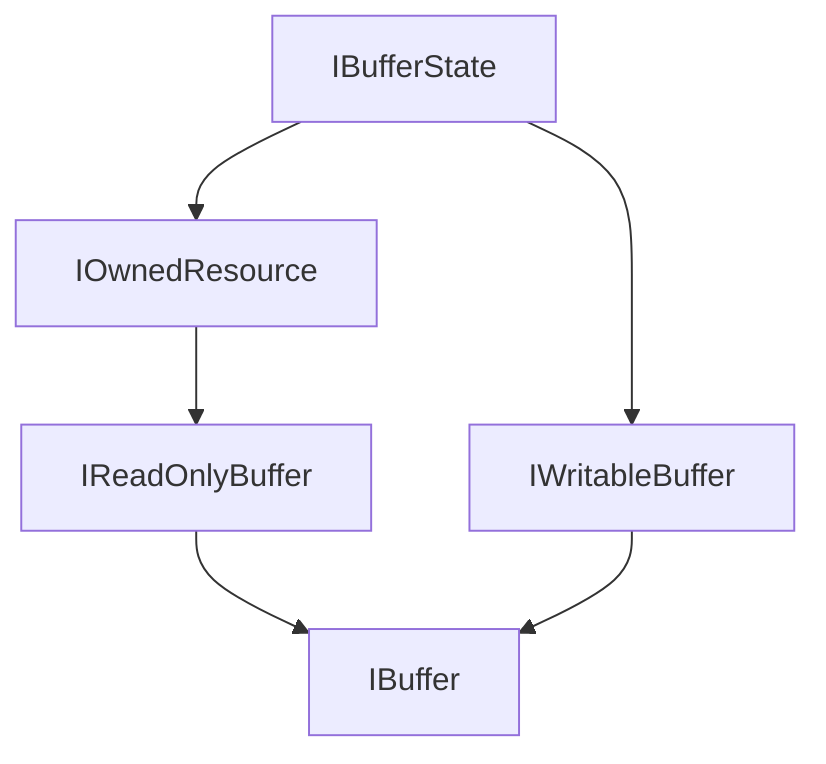

# BitzBuffer 設計仕様 - コアインターフェース

このドキュメントは、バッファ管理ライブラリ「BitzBuffer」の中心となる共通インターフェース群について詳述します。

## 1. はじめに

BitzBufferライブラリは、効率的なメモリ管理と高性能なデータ操作を提供することを目的としています。その中核となるのが、これから定義するインターフェース群です。これらのインターフェースは、マネージドメモリ、アンマネージドメモリ、そして将来的にはGPUメモリといった多様なメモリリソースを統一的に扱うための抽象化レイヤーを提供します。

## 2. 設計思想と主要なゴール

*   **統一性:** 様々な種類のメモリバッファを、共通のインターフェースを通じて操作できるようにします。
*   **パフォーマンス:** `Span<T>` や `Memory<T>`、`ReadOnlySequence<T>` を活用し、メモリアロケーションのオーバーヘッドを最小限に抑え、ゼロコピー操作を促進します。
*   **安全性:** 明確な所有権管理とライフサイクルを通じて、メモリリークやダングリングポインタといった問題を回避します。
*   **柔軟性:** 非連続メモリのサポートや、読み取り専用ビュー、書き込み操作の効率化など、多様なユースケースに対応できる柔軟性を提供します。
*   **拡張性:** 将来的に新しい種類のメモリリソース（例: GPUバッファ）や、より高度なバッファ操作をサポートするための拡張が容易な設計を目指します。

## 3. バッファ共通インターフェース

アプリケーション内で多様なメモリリソースを統一的に扱うため、中心となるバッファインターフェース群を定義します。これらのインターフェースは、非連続メモリへの対応、効率的な読み書き、そして明確な所有権管理とライフサイクルを考慮して設計されています。

### 3.1. 設計のキーポイント

*   **非連続メモリのサポート (`ReadOnlySequence<T>`):**
    *   物理的に連続していない複数のメモリセグメントを、単一の論理的な読み取りシーケンスとして効率的に扱えるようにします。これにより、データの再コピーを避け、メモリ効率を向上させます。
    *   `System.IO.Pipelines` のコンセプトに触発されています。
*   **効率的な書き込み (`GetMemory`/`Advance` パターン):**
    *   `IWritableBuffer<T>` は、`System.IO.Pipelines.PipeWriter` に似た `GetMemory(int sizeHint)` と `Advance(int count)` のパターンを提供します。これにより、バッファの末尾に効率的にデータを書き込むことができます。`sizeHint` は、書き込みたいおおよそのサイズをバッファに伝えるためのヒントです。
*   **所有権管理とライフサイクル (`IBufferState`, `IOwnedResource`):**
    *   `IBufferState` は、バッファが基になるリソースの有効な所有権を持っているか (`IsOwner`)、既に破棄されたか (`IsDisposed`) を示すプロパティを提供します。
    *   `IOwnedResource` は `IBufferState` を拡張し、`IDisposable` を実装することで、リソースの解放責任を明確にします。利用者は `Dispose()` を呼び出すことで、リソースを適切に解放（プールへの返却または直接解放）する責任があります。
    *   所有権の移譲メカニズム（例: `TryAttachZeroCopy`）により、データの物理的なコピーなしに、あるバッファから別のバッファへセグメントの所有権と解放責任を移すことを目指します。
*   **読み取り専用ビュー (`Slice`):**
    *   `IReadOnlyBuffer<T>.Slice()` 操作は、元のバッファのデータを参照する新しい読み取り専用の `IReadOnlyBuffer<T>` インスタンス（ビュー）を返します。このビューはデータを所有せず (`IsOwner == false`)、ゼロコピーで作成されます。元のバッファが無効になると、スライスビューも無効になります。
*   **型安全性とパフォーマンス:**
    *   `Span<T>`, `Memory<T>`, `ReadOnlySequence<T>` といった .NET の最新のメモリ関連型を最大限に活用し、型安全で高性能なデータアクセスを実現します。
*   **ゼロコピーアタッチのためのセグメント情報 (`BitzBufferSequenceSegment<T>` - Issue #33 で詳細定義):**
    *   ゼロコピーでの所有権移譲を安全かつ効率的に行うため、本ライブラリは `System.Buffers.ReadOnlySequenceSegment<T>` を拡張した `BitzBufferSequenceSegment<T>` という内部的なカスタムセグメントクラスの概念を導入します（予定）。
    *   このカスタムセグメントは、標準のメモリ情報に加え、そのセグメントの「所有者」（解放責任を持つ `IDisposable` オブジェクト）や、それが属する元の `IBuffer<T>` インスタンスへの参照、所有権移譲の可否といったメタデータを保持します。
    *   `IReadOnlyBuffer<T>` は、この `BitzBufferSequenceSegment<T>` のシーケンスを提供する `AsAttachableSegments()` メソッドを公開する予定です。

### 3.2. インターフェース階層



*   **`IBufferState`**: バッファの基本的な状態（所有権、破棄状態）を定義します。
*   **`IOwnedResource`**: リソースの所有と解放の責任 (`IDisposable`) を追加します。
*   **`IReadOnlyBuffer<T>`**: 読み取り専用のバッファ操作を提供します。
*   **`IWritableBuffer<T>`**: 書き込み専用のバッファ操作を提供します。
*   **`IBuffer<T>`**: 読み書き可能な完全なバッファ操作を提供します。

### 3.3. インターフェース定義 (C# イメージ)

```csharp
using System;
using System.Buffers;
using System.Collections.Generic; // For IEnumerable in IWritableBuffer<T>.TryAttachZeroCopy (placeholder)
using System.Diagnostics.CodeAnalysis; // For MaybeNullWhen

// バッファの基本的な状態（所有権、破棄状態）を示すインターフェース。
public interface IBufferState
{
    /// <summary>
    /// このインスタンスが現在、基になるリソースに対する有効な所有権を持っているかどうかを示します。
    /// 所有権が移譲されたり、リソースが破棄されたりすると false になることがあります。
    /// 書き込み操作など、一部の操作は所有権がある場合にのみ許可されます。
    /// </summary>
    bool IsOwner { get; }

    /// <summary>
    /// このインスタンスが既に破棄 (Dispose) されているかどうかを示します。
    /// true の場合、このオブジェクトのほとんどのメソッドやプロパティへのアクセスは
    /// <see cref="ObjectDisposedException"/> をスローすることが期待されます。
    /// </summary>
    bool IsDisposed { get; }
}

// リソースの所有と解放の責任 (IDisposable) を持つインターフェース。
public interface IOwnedResource : IBufferState, IDisposable
{
    // IsOwner, IsDisposed は IBufferState から継承。
    // Dispose は IDisposable から継承。
    // Dispose() は、所有権を持つリソースを解放（プールへの返却または直接解放）し、
    // IsOwner を false に、IsDisposed を true に設定することが期待されます。
    // 所有権がない場合 (IsOwner == false)、Dispose() は主に IsDisposed を true に設定し、
    // 実質的なリソース解放は行わない（既に責任がないため）ことが期待されます。
    // 複数回の Dispose() 呼び出しは安全であるべきです（2回目以降は何もしない）。
}

// 読み取り専用のバッファ操作を提供するインターフェース。
public interface IReadOnlyBuffer<T> : IOwnedResource where T : struct
{
    /// <summary>
    /// バッファに書き込まれた有効なデータの論理的な長さ（要素数）を取得します。
    /// </summary>
    /// <exception cref="ObjectDisposedException">バッファが既に破棄されている場合にスローされます。</exception>
    long Length { get; }

    /// <summary>
    /// バッファが空 (Length == 0) かどうかを示します。
    /// </summary>
    /// <exception cref="ObjectDisposedException">バッファが既に破棄されている場合にスローされます。</exception>
    bool IsEmpty { get; }

    /// <summary>
    /// バッファが単一の連続したメモリセグメントで構成されているかどうかを示します。
    /// true の場合、TryGetSingleSpan や TryGetSingleMemory が成功する可能性が高まります。
    /// </summary>
    /// <exception cref="ObjectDisposedException">バッファが既に破棄されている場合にスローされます。</exception>
    bool IsSingleSegment { get; }

    /// <summary>
    /// バッファの現在の書き込み済み内容 (Length で示される範囲) を表す <see cref="ReadOnlySequence{T}"/> を取得します。
    /// このメソッドは常に有効なシーケンスを返しますが、バッファが空の場合は空のシーケンス (<see cref="ReadOnlySequence{T}.IsEmpty"/> が true) を返します。
    /// </summary>
    /// <returns>バッファの内容を表す <see cref="ReadOnlySequence{T}"/>。</returns>
    /// <exception cref="ObjectDisposedException">このバッファインスタンスまたは参照元のリソースが破棄されている場合にスローされます。</exception>
    ReadOnlySequence<T> AsReadOnlySequence();

    /// <summary>
    /// バッファ全体が単一の連続したメモリセグメントで構成され、かつデータが存在する場合 (Length > 0)、
    /// その書き込み済みデータ領域の <see cref="ReadOnlySpan{T}"/> を取得します。
    /// </summary>
    /// <param name="span">成功した場合、データ領域を指す <see cref="ReadOnlySpan{T}"/>。失敗した場合は <see cref="ReadOnlySpan{T}.Empty"/>。</param>
    /// <returns>取得に成功した場合は true、それ以外の場合は false。</returns>
    /// <remarks>
    /// このバッファインスタンスまたは参照元のリソースが破棄 (IsDisposed が true) されている場合は false を返します。
    /// バッファが非連続メモリで構成されている場合や、データが存在しない場合も false を返します。
    /// 例外をスローするのではなく、成否を bool 値で返すことを意図しています。
    /// </remarks>
    bool TryGetSingleSpan(out ReadOnlySpan<T> span);

    /// <summary>
    /// バッファ全体が単一の連続したメモリセグメントで構成され、かつデータが存在する場合 (Length > 0)、
    /// その書き込み済みデータ領域の <see cref="ReadOnlyMemory{T}"/> を取得します。
    /// </summary>
    /// <param name="memory">成功した場合、データ領域を指す <see cref="ReadOnlyMemory{T}"/>。失敗した場合は <see cref="ReadOnlyMemory{T}.Empty"/>。</param>
    /// <returns>取得に成功した場合は true、それ以外の場合は false。</returns>
    /// <remarks>
    /// このバッファインスタンスまたは参照元のリソースが破棄 (IsDisposed が true) されている場合は false を返します。
    /// バッファが非連続メモリで構成されている場合や、データが存在しない場合も false を返します。
    /// 例外をスローするのではなく、成否を bool 値で返すことを意図しています。
    /// </remarks>
    bool TryGetSingleMemory(out ReadOnlyMemory<T> memory);

    /// <summary>
    /// バッファの指定された範囲を表す新しい読み取り専用バッファ (スライス) を作成します。
    /// 返されるスライスはデータを所有せず (<see cref="IBufferState.IsOwner"/> が false)、ゼロコピーで作成されます。
    /// </summary>
    /// <param name="start">スライスの開始オフセット（現在のバッファの先頭からの要素数）。</param>
    /// <param name="length">スライスの長さ（要素数）。</param>
    /// <returns>指定された範囲を表す新しい <see cref="IReadOnlyBuffer{T}"/>。</returns>
    /// <exception cref="ObjectDisposedException">バッファが既に破棄されている場合にスローされます。</exception>
    /// <exception cref="ArgumentOutOfRangeException"><paramref name="start"/> または <paramref name="length"/> が不正な場合 (例: 負数、範囲外)。</exception>
    IReadOnlyBuffer<T> Slice(long start, long length);

    /// <summary>
    /// バッファの指定された開始位置から末尾までを表す新しい読み取り専用バッファ (スライス) を作成します。
    /// </summary>
    /// <param name="start">スライスの開始オフセット（現在のバッファの先頭からの要素数）。</param>
    /// <returns>指定された範囲を表す新しい <see cref="IReadOnlyBuffer{T}"/>。</returns>
    /// <exception cref="ObjectDisposedException">バッファが既に破棄されている場合にスローされます。</exception>
    /// <exception cref="ArgumentOutOfRangeException"><paramref name="start"/> が不正な場合 (例: 負数、範囲外)。</exception>
    IReadOnlyBuffer<T> Slice(long start);

    // TODO (Issue #33): ゼロコピーアタッチのためのセグメント情報を提供するメソッドを追加する可能性がある。
    // public IEnumerable<BitzBufferSequenceSegment<T>> AsAttachableSegments();
}

// AttachmentResult enum: AttachSequence メソッドの操作結果を示す
public enum AttachmentResult
{
    /// <summary>データを物理的にコピーせずにアタッチに成功しました。</summary>
    AttachedAsZeroCopy,
    /// <summary>データを物理的にコピーしてアタッチしました。</summary>
    AttachedAsCopy,
    /// <summary>ゼロコピーでのアタッチ試行に失敗しました（TryAttachZeroCopy でのみ使用）。</summary>
    Failed
}

// 書き込み専用のバッファ操作を提供するインターフェース。
// 書き込み操作は通常 IsOwner が true である必要がある。
public interface IWritableBuffer<T> : IBufferState where T : struct
{
    /// <summary>
    /// バッファの現在の論理的な末尾 (Length の位置) 以降に、
    /// 少なくとも sizeHint 要素分の書き込み可能な連続メモリ領域を要求します。
    /// 返される <see cref="Memory{T}"/> の実際の長さは、バッファの実装や空き容量に依存するため、
    /// <see cref="Memory{T}.Length"/> を確認する必要があります。
    /// 要求したサイズが確保できない場合でも、利用可能な範囲で <see cref="Memory{T}"/> を返すことがありますが、
    /// 全く確保できない場合は空の <see cref="Memory{T}"/> (<see cref="Memory{T}.IsEmpty"/> が true) を返すことがあります。
    /// </summary>
    /// <param name="sizeHint">要求する最小の要素数。0の場合、実装は適切なデフォルトサイズまたは残りの全容量を返そうとします。</param>
    /// <returns>書き込み可能なメモリ領域を表す <see cref="Memory{T}"/>。</returns>
    /// <exception cref="ObjectDisposedException">バッファが既に破棄されている場合にスローされます。</exception>
    /// <exception cref="InvalidOperationException"><see cref="IBufferState.IsOwner"/> が false の場合にスローされます。</exception>
    /// <exception cref="ArgumentOutOfRangeException"><paramref name="sizeHint"/> が負の場合にスローされます。</exception>
    Memory<T> GetMemory(int sizeHint = 0);

    /// <summary>
    /// <see cref="GetMemory"/> で取得した領域に <paramref name="count"/> 要素分のデータを書き込んだことをバッファに通知し、
    /// バッファの論理的な書き込み済み長さ (<see cref="IReadOnlyBuffer{T}.Length"/> プロパティ) を <paramref name="count"/> だけ進めます。
    /// </summary>
    /// <param name="count">実際に書き込んだ要素数。</param>
    /// <exception cref="ObjectDisposedException">バッファが既に破棄されている場合にスローされます。</exception>
    /// <exception cref="InvalidOperationException"><see cref="IBufferState.IsOwner"/> が false の場合にスローされます。</exception>
    /// <exception cref="ArgumentOutOfRangeException"><paramref name="count"/> が負であるか、進めるとバッファの物理キャパシティを超える場合にスローされます。</exception>
    void Advance(int count);

    // --- データ書き込みメソッド ---
    // 各Writeメソッドは、IsOwner が false または IsDisposed が true の場合、例外をスローします。
    // 書き込みによりバッファの物理容量を超える場合、ArgumentExceptionをスローすることがあります。

    /// <summary>
    /// 指定されたソーススパンの内容をバッファの現在の書き込み位置にコピーします。
    /// </summary>
    /// <param name="source">書き込むデータを含むソーススパン。</param>
    void Write(ReadOnlySpan<T> source);
    /// <summary>
    /// 指定されたソースメモリ領域の内容をバッファの現在の書き込み位置にコピーします。
    /// </summary>
    /// <param name="source">書き込むデータを含むソースメモリ領域。</param>
    void Write(ReadOnlyMemory<T> source);
    /// <summary>
    /// 単一の値をバッファの現在の書き込み位置に書き込みます。
    /// </summary>
    /// <param name="value">書き込む値。</param>
    void Write(T value);
    /// <summary>
    /// 指定されたソースシーケンスの内容をバッファの現在の書き込み位置にコピーします。
    /// ソースシーケンスが非連続メモリの場合でも、内容は連続的にバッファにコピーされます。
    /// </summary>
    /// <param name="source">書き込むデータを含むソースシーケンス。</param>
    void Write(ReadOnlySequence<T> source);

    // --- データアタッチメソッド ---
    // 各アタッチメソッドは、IsOwner が false または IsDisposed が true の場合、例外をスローします。

    /// <summary>
    /// 指定されたソースシーケンスを、このバッファにアタッチ（またはコピー）します。
    /// </summary>
    /// <param name="sequenceToAttach">アタッチまたはコピーするソースシーケンス。</param>
    /// <param name="attemptZeroCopy">可能であればゼロコピーでのアタッチを試みるかどうか。デフォルトは true。</param>
    /// <returns>アタッチ操作の結果を示す <see cref="AttachmentResult"/>。</returns>
    /// <remarks>
    /// ゼロコピーが可能かどうかはバッファの実装に依存します。
    /// 例えば、連続メモリバッファは通常、外部シーケンスをコピーします。
    /// 非連続メモリバッファは、条件が合えばゼロコピーアタッチを行える可能性があります。
    /// </remarks>
    AttachmentResult AttachSequence(ReadOnlySequence<T> sequenceToAttach, bool attemptZeroCopy = true);
    // TODO: IReadOnlyBuffer<T> を引数に取る AttachSequence オーバーロードも検討 (02_Providers_And_Buffers.md 参照)
    // AttachmentResult AttachSequence(IReadOnlyBuffer<T> sourceBitzBuffer, bool attemptZeroCopy = true);


    /// <summary>
    /// 指定されたソースシーケンスを、ゼロコピーでこのバッファにアタッチすることを試みます。
    /// </summary>
    /// <param name="sequenceToAttach">アタッチを試みるソースシーケンス。</param>
    /// <returns>ゼロコピーアタッチに成功した場合は true、それ以外の場合は false。</returns>
    /// <remarks>
    /// このメソッドは、データの物理的なコピーを避けることを優先します。
    /// 成功した場合、<paramref name="sequenceToAttach"/> が表すメモリセグメントの所有権が
    /// このバッファに移譲されることがあります（具体的な挙動は実装クラスに依存）。
    /// ゼロコピーアタッチが不可能な場合やサポートされていない場合は false を返します。
    /// (より詳細なゼロコピー制御は IEnumerable<BitzBufferSequenceSegment<T>> を取るオーバーロードで提供予定)
    /// </remarks>
    bool TryAttachZeroCopy(ReadOnlySequence<T> sequenceToAttach);
    // TODO (Issue #33): IEnumerable<BitzBufferSequenceSegment<T>> を引数に取る TryAttachZeroCopy オーバーロードを定義する。
    // bool TryAttachZeroCopy(IEnumerable<BitzBufferSequenceSegment<T>> segmentsToAttach);

    // --- その他の書き込み関連メソッド ---
    // 各メソッドは、IsOwner が false または IsDisposed が true の場合、例外をスローします。

    /// <summary>
    /// 指定されたデータをバッファの先頭に挿入します。
    /// この操作は、実装によっては高コストになる可能性があります（既存データのシフトなど）。
    /// </summary>
    /// <param name="source">先頭に挿入するデータを含むソーススパン。</param>
    /// <exception cref="NotImplementedException">実装クラスがこの操作を効率的にサポートしていない場合にスローされることがあります。</exception>
    void Prepend(ReadOnlySpan<T> source);
    /// <summary>
    /// 指定されたデータをバッファの先頭に挿入します。
    /// </summary>
    /// <param name="source">先頭に挿入するデータを含むソースメモリ領域。</param>
    void Prepend(ReadOnlyMemory<T> source);
    /// <summary>
    /// 指定されたデータをバッファの先頭に挿入します。データは常にコピーされます。
    /// </summary>
    /// <param name="source">先頭に挿入するデータを含むソースシーケンス。</param>
    void Prepend(ReadOnlySequence<T> source);

    /// <summary>
    /// バッファの論理的な書き込み済み長さ (<see cref="IReadOnlyBuffer{T}.Length"/>) を0にリセットします。
    /// オプションで、確保されているメモリ領域の内容もクリアされるかどうかは、実装またはクリアポリシーに依存します。
    /// </summary>
    void Clear();

    /// <summary>
    /// バッファの論理的な書き込み済み長さ (<see cref="IReadOnlyBuffer{T}.Length"/>) を指定された長さに切り詰めます。
    /// </summary>
    /// <param name="length">新しい論理的な長さ。現在の Length 以下でなければなりません。</param>
    /// <exception cref="ArgumentOutOfRangeException"><paramref name="length"/> が負であるか、現在の Length より大きい場合にスローされます。</exception>
    void Truncate(long length);
}

// 読み書き可能な完全なバッファインターフェース。
// BitzBufferライブラリにおける最も主要なバッファ表現。
public interface IBuffer<T> : IReadOnlyBuffer<T>, IWritableBuffer<T>
    where T : struct
{
    // IBufferState のメンバー (IsOwner, IsDisposed) は両方の親インターフェースから継承されるが、
    // 実装は単一の underlying state を持つことが期待される。
    // IDisposable は IReadOnlyBuffer<T> (IOwnedResource経由) から継承。

    // 実装クラスは、IsOwner および IsDisposed の状態に基づいて、
    // 各メソッドが呼び出された際に適切に例外をスローする責任を負います。
    // (例外の詳細は Docs/BitzBuffer/05_Error_Handling.md を参照)
}

// バッファの生成と管理を行うプロバイダのインターフェース。
// プーリングやバッファの種類ごとに異なる実装が可能。
public interface IBufferProvider : IDisposable
{
    /// <summary>
    /// 指定した最小長さ以上のバッファをレンタルします。
    /// 実装によっては、プーリングされた既存のバッファを再利用することがあります。
    /// </summary>
    /// <typeparam name="TItem">バッファの要素型。</typeparam>
    /// <param name="minimumLength">要求するバッファの最小要素数。0以上の値を指定する必要があります。</param>
    /// <returns>要求を満たす <see cref="IBuffer{TItem}"/>。</returns>
    /// <exception cref="ObjectDisposedException">このプロバイダが既に破棄されている場合にスローされます。</exception>
    /// <exception cref="ArgumentOutOfRangeException"><paramref name="minimumLength"/> が負の場合にスローされます。</exception>
    /// <exception cref="OutOfMemoryException">要求されたサイズのバッファを確保できなかった場合にスローされることがあります。</exception>
    /// <exception cref="BufferManagementException">その他のバッファ管理に関連する例外が発生した場合（例: プール枯渇）。</exception>
    IBuffer<TItem> Rent<TItem>(int minimumLength = 0) where TItem : struct;

    /// <summary>
    /// 指定した最小長さ以上のバッファのレンタルを試みます。
    /// 成功時は true とバッファを返し、失敗時は false とバッファのデフォルト値を返します。
    /// </summary>
    /// <typeparam name="TItem">バッファの要素型。</typeparam>
    /// <param name="minimumLength">要求するバッファの最小要素数。</param>
    /// <param name="buffer">成功した場合、レンタルされたバッファ。失敗した場合は default。</param>
    /// <returns>レンタルの成否。</returns>
    /// <remarks>
    /// このメソッドは、主にリソースの確保に失敗した場合（例: メモリ不足で新しいバッファを確保できない、またはプールが枯渇している場合）に false を返します。
    /// ただし、引数 <paramref name="minimumLength"/> が事前条件（0以上であることなど）を満たさない場合は、
    /// <see cref="ArgumentOutOfRangeException"/> のような引数関連の例外をスローすることがあります。
    /// これは、APIの誤用を早期に検出するための措置です。
    /// プロバイダが破棄済みの場合は false を返します。
    /// </remarks>
    bool TryRent<TItem>(int minimumLength, [MaybeNullWhen(false)] out IBuffer<TItem> buffer) where TItem : struct;

    /// <summary>
    /// 指定した正確な長さの新しいバッファを生成します。
    /// このメソッドは通常、プーリングを行わず、常に新しいバッファインスタンスを返します。
    /// </summary>
    /// <typeparam name="TItem">バッファの要素型。</typeparam>
    /// <param name="exactLength">要求するバッファの正確な要素数。0以上の値を指定する必要があります。</param>
    /// <returns>生成された新しい <see cref="IBuffer{TItem}"/>。</returns>
    /// <exception cref="ObjectDisposedException">このプロバイダが既に破棄されている場合にスローされます。</exception>
    /// <exception cref="ArgumentOutOfRangeException"><paramref name="exactLength"/> が負の場合にスローされます。</exception>
    /// <exception cref="OutOfMemoryException">要求されたサイズのバッファを確保できなかった場合にスローされることがあります。</exception>
    IBuffer<TItem> CreateBuffer<TItem>(int exactLength) where TItem : struct;

    /// <summary>
    /// 指定した正確な長さの新しいバッファ生成を試みます。
    /// 成功時は true とバッファを返し、失敗時は false とバッファのデフォルト値を返します。
    /// </summary>
    /// <typeparam name="TItem">バッファの要素型。</typeparam>
    /// <param name="exactLength">要求するバッファの正確な要素数。</param>
    /// <param name="buffer">成功した場合、生成された新しいバッファ。失敗した場合は default。</param>
    /// <returns>バッファ生成の成否。</returns>
    /// <remarks>
    /// このメソッドは、主にリソースの確保に失敗した場合（例: メモリ不足）に false を返します。
    /// ただし、引数 <paramref name="exactLength"/> が事前条件（0以上であることなど）を満たさない場合は、
    /// <see cref="ArgumentOutOfRangeException"/> のような引数関連の例外をスローすることがあります。
    /// これは、APIの誤用を早期に検出するための措置です。
    /// プロバイダが破棄済みの場合は false を返します。
    /// </remarks>
    bool TryCreateBuffer<TItem>(int exactLength, [MaybeNullWhen(false)] out IBuffer<TItem> buffer) where TItem : struct;

    // プーリング統計情報取得API（将来の拡張用。具体的な型は Diagnostics/PoolingStatistics.cs などで定義予定）
    // PooledBufferStatistics GetPoolingOverallStatistics();
    // System.Collections.Generic.IReadOnlyDictionary<int, PooledBufferStatistics> GetPoolingBucketStatistics();
    /// <summary>
    /// このプロバイダが管理するプーリング機構全体の統計情報を取得します。(将来実装予定)
    /// </summary>
    /// <returns>全体のプーリング統計情報。プーリングを使用しない場合はデフォルト値または空の情報を返します。</returns>
    /// <exception cref="ObjectDisposedException">このプロバイダが既に破棄されている場合にスローされます。</exception>
    object GetPoolingOverallStatistics(); // 型は将来 PooledBufferStatistics に変更予定

    /// <summary>
    /// このプロバイダが管理するプーリング機構のバケットごとの統計情報を取得します。(将来実装予定)
    /// </summary>
    /// <returns>バケットサイズをキーとする統計情報の読み取り専用ディクショナリ。プーリングを使用しない場合は空のディクショナリを返します。</returns>
    /// <exception cref="ObjectDisposedException">このプロバイダが既に破棄されている場合にスローされます。</exception>
    System.Collections.Generic.IReadOnlyDictionary<int, object> GetPoolingBucketStatistics(); // 値の型は将来 PooledBufferStatistics に変更予定
}

```
